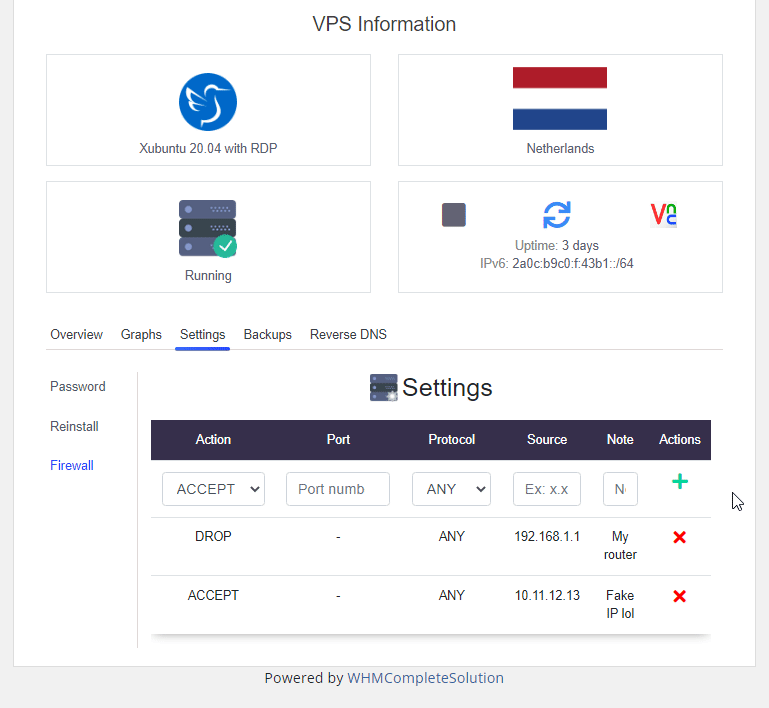
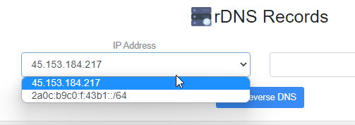

# WHMCS Server Provisioning - [VPSAG](https://www.vpsag.com/)
Below you'll find how to install and configure this WHMCS Server Module. If you have any questions or problems, I will be at your disposal to configure it remotely.

## Description
Start selling VPSAG services with this module!

# Screenshots

.png)

# Install
1. Upload the `modules` folder to your WHMCS Installation;
2. Go to `System Settings -> Servers` and add a new Server, on the Module field choose `Andrezzz - VPSAG` and fill with all the data;
3. Click on `Test connection` button. If you get any error, please recheck the data entered, if not you can save the Server;
4. Go to `System Settings -> Products/Services` and create a new Product, on the Module field choose `Andrezzz - VPSAG` and save the Product.

# Contact information
[Website](https://www.andrezzz.pt) 
[Discord](https://www.andrezzz.pt/discord) 

# Copyright
Copyright (c) 2022 André Antunes (Andrezzz). All rights reserved. You can't sell this WHMCS Server Module as your authorship.
